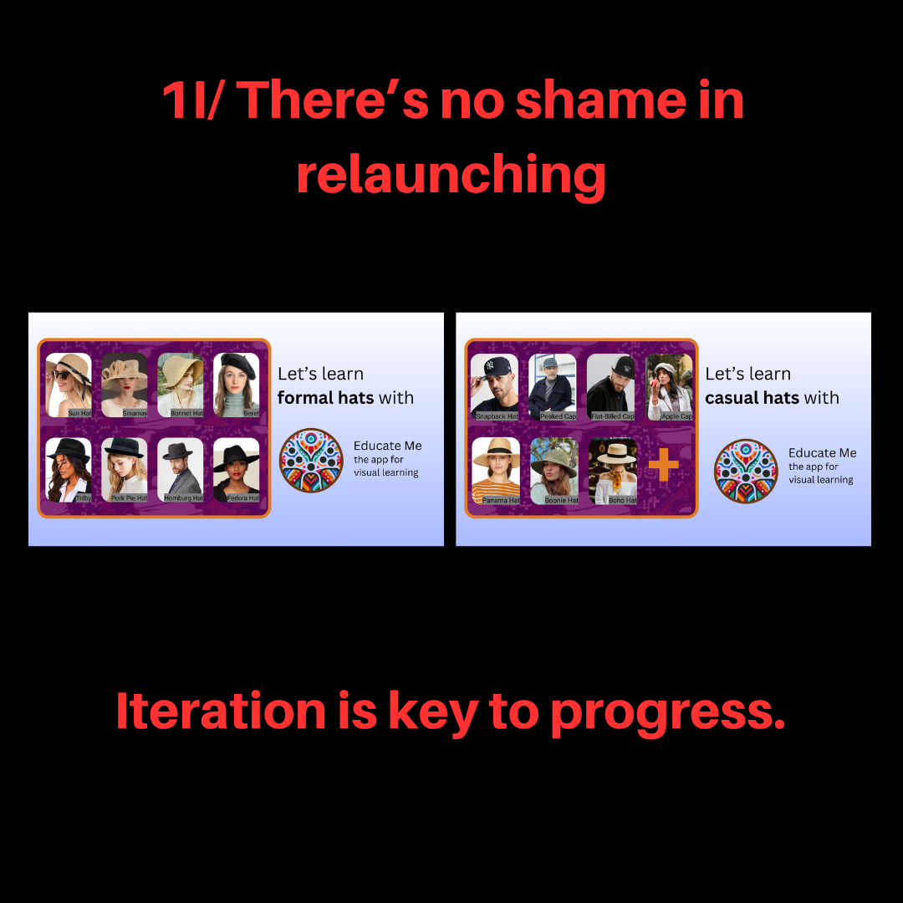
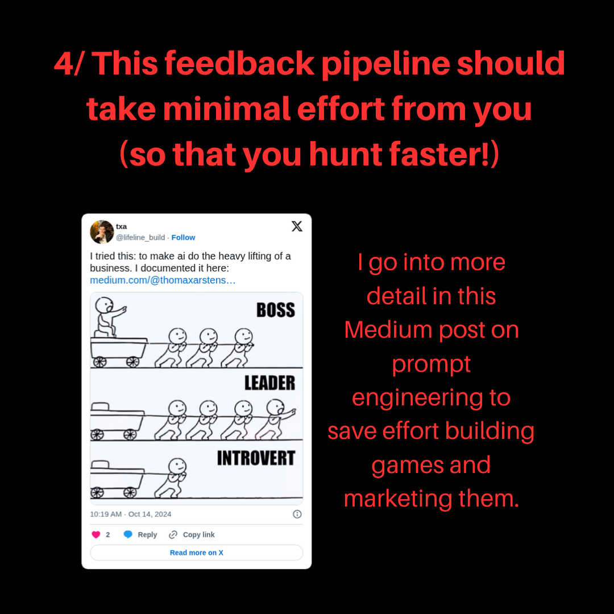
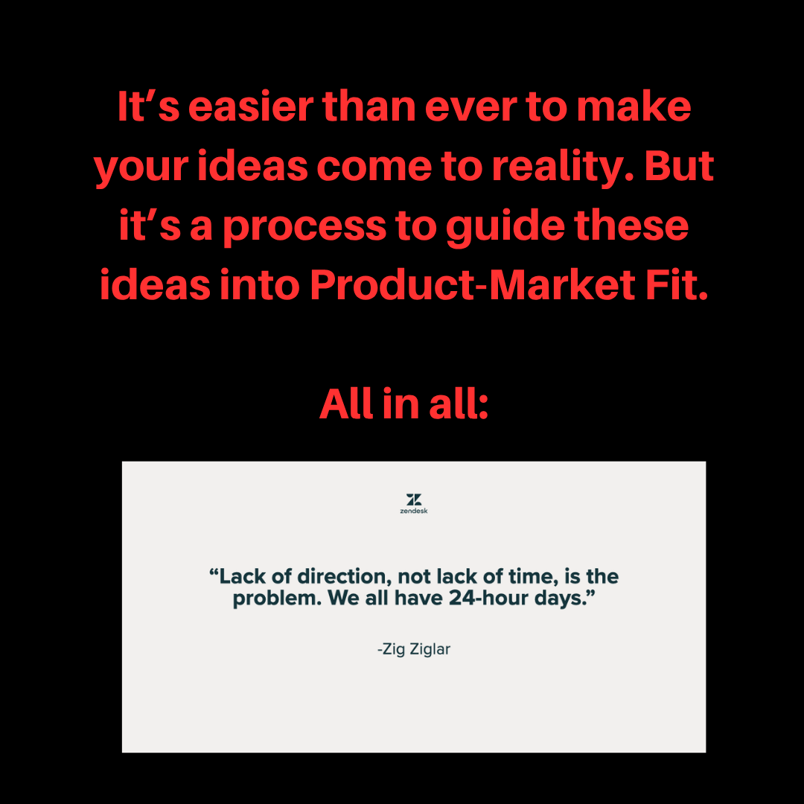
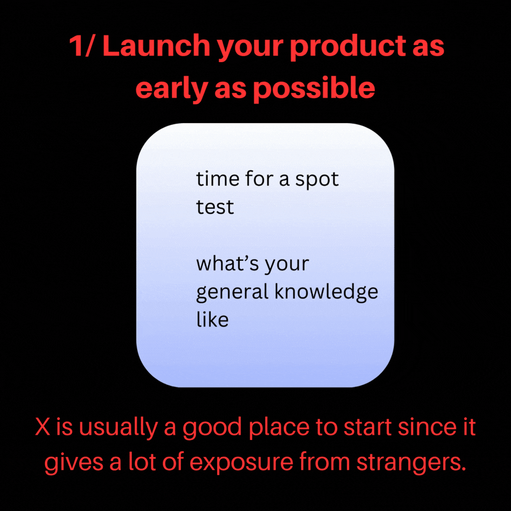
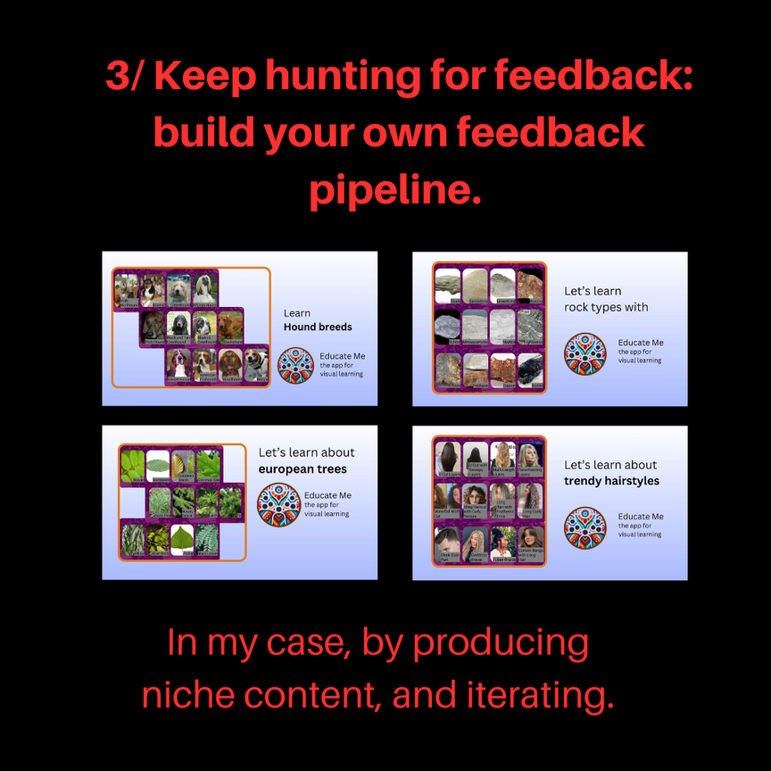

# Educate Me

Pictorial learning as a memory game. You are shown a set of images from one category — animal tracks, hound breeds, rock types, European trees — and you learn to tell them apart by playing, not by reading captions.

| Tips to build in public | There's no shame in relaunching |
| --- | --- |
|  |  |
| **The feedback pipeline should take minimal effort** | **Product-market fit** |
|  |  |

Built for the **buildspace** cohort — I wrote up the experience in [On my work with applicative AI at buildspace](https://medium.com/@thomaxarstens/on-my-work-with-applicative-ai-at-buildspace-c566b7d137e7). Earlier iteration: [react-firebase-photoshare](https://github.com/ThomasCarstens/react-firebase-photoshare)

## The idea

Most learning apps I had built up to this point helped the *teaching* process — course platforms, seminar admin, tutor-to-student pipes. This one is aimed at the learning process directly, and the format is deliberately narrow: a category, a set of pictures, and repetition until you can name them.

Categories built out during development included animal tracks, hound breeds, rock types, European trees, hat styles and hairstyles — anything where the whole skill is visual discrimination and a book is a bad medium.

| Which tracks are these? | Hound breeds, rock types, European trees, hairstyles |
| --- | --- |
|  |  |

## Built in public

The project was developed openly, and the lessons from doing that are worth as much as the app.

**1. Launch as early as possible.** The first version goes out before it is comfortable. You cannot find out whether people want to identify animal tracks by thinking about it.

**2. There is no shame in relaunching.** The category set, the tone, the framing — all of it changed once real users touched it.

**3. Keep hunting for feedback — build your own feedback pipeline.** Waiting for feedback to arrive means getting none. Going and building the channel is the work.

**4. That pipeline should take minimal effort to run.** A feedback loop you have to force yourself to run is a feedback loop you will stop running. Automating the summarising step — the subject of [that write-up](https://medium.com/@thomaxarstens/on-my-work-with-applicative-ai-at-buildspace-c566b7d137e7) — is what kept it alive.

**5. All of it is in service of product-market fit**, which is the only thing the launch was ever measuring.


## Stack

React Native on **Expo (SDK 50)** with React Navigation, Firebase for auth and storage, `expo-image-picker` and `expo-av` for the media flow, and `expo-screen-orientation` for the game view.

```bash
npm install

npm start          # expo start --dev-client
npm run android
npm run ios
npm run web
```

See `RUNCOMMANDS.md` for build and release commands. `screens/` holds the game and auth flows; `firebase.js` initialises the client.

---

More project write-ups: [thomascarstens.github.io](https://thomascarstens.github.io) · Questions: thomaxarstens@gmail.com
